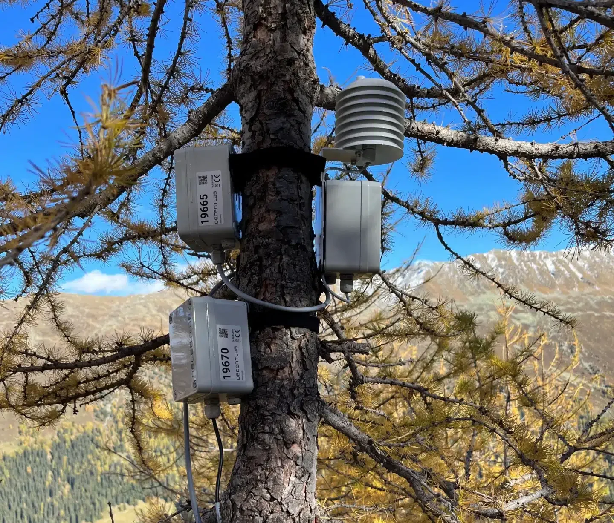

# TreeNetAI
<p align="center">
	
	
</p>

## A Toolbox designed around neural networks for time series analysis

<!--Let people know what your project can do specifically. Provide context and add a link to any reference visitors might be unfamiliar with. A list of Features or a Background subsection can also be added here. If there are alternatives to your project, this is a good place to list differentiating factors. -->

This toolbox uses machine learning methods to process data in the form of time series. Therefore, as input I have a time series and as output a modified version of the original time series. The directory structure of my files is the following:


## Directory Structure

The main components of the software are the following:

- `models/`: Contains the architecture of each model.
- `raw_data_elaboration/`: Scripts for downloading, processing, and converting raw data.
- `utils/`: Utility scripts for loading models and other helper functions.
- `scripts/`: Bash scripts for downloading raw data, creating TFRecords, training and evaluating the model, and gap-filling data.
- `config.py`: Configuration file for hyperparameters and other settings.
- `training.py`: Main script for training the neural network.
- `evaluation.py`: Script for evaluating the trained model.

In more detail, the relevan directory strucutre looks like the following:
```
TreeNetAI/
	|-- models/
		|-- templates/
		|-- trained/
	|-- raw_data_elaboration/
		|-- tools/
			|-- config_server.yml (not included)
			|-- data_organisation.py
			|-- data_statistics.py
			|-- server_tools.py
		|-- data_processing_library.py
		|-- feature_descriptions.py
		|-- load_and_convert_raw_data.py
		|-- tfrecords_make.py
		|-- tfrecords_load.py
	|-- scripts/
		|-- 0_get_data.sh
		|-- 1_make_tfrecords.sh
		|-- 2_train_model.sh
		|-- 3_evaluate_model.sh
		|-- 4_fill_gaps.sh
	|-- utils/
		|-- evaluation_tools.py
		|-- get_model.py
		|-- logger.py
		|-- utils.py
	|-- config.py
	|-- evaluation.py
	|-- training.py

```

<!-- ## Badges
On some READMEs, you may see small images that convey metadata, such as whether or not all the tests are passing for the project. You can use Shields to add some to your README. Many services also have instructions for adding a badge. -->

<!-- ## Visuals
Depending on what you are making, it can be a good idea to include screenshots or even a video (you'll frequently see GIFs rather than actual videos). Tools like ttygif can help, but check out Asciinema for a more sophisticated method. -->

## Installation
<!-- Within a particular ecosystem, there may be a common way of installing things, such as using Yarn, NuGet, or Homebrew. However, consider the possibility that whoever is reading your README is a novice and would like more guidance. Listing specific steps helps remove ambiguity and gets people to using your project as quickly as possible. If it only runs in a specific context like a particular programming language version or operating system or has dependencies that have to be installed manually, also add a Requirements subsection. -->
For the moment it is only possible to clone the repository to a PC and use the toolbox as a python library.

## Usage
<!-- Use examples liberally, and show the expected output if you can. It's helpful to have inline the smallest example of usage that you can demonstrate, while providing links to more sophisticated examples if they are too long to reasonably include in the README. -->

### Data preparation for model input
The first step of the tool work-flow is to convert the format of the time series data so that it is compatible with the input requirements of the machine learning model and store it in the tensorflow TFrecords format.  There is a script that (`load_and_convert_raw_data.py`) that downloads the raw data and corresponding metadata directly from a PostgreSQL database. The raw data is processed so that it can be used as input for the machine learning models. In particular, there is a script (`tfrecord_make.py`) that combines the downloaded data and metadata into the tfrecords format, so that the neural network training input and corresponding labels are always together in the tfrecords data structure. 

### Model training
The second part of the project is the training phase. The main script for this phase is the `training.py` file. It is combined with the `utils.py` script to load the tfrecords (with the help of the `tfrecords_load.py` script), to load the desired model (with the help of the `get_model.py` script) and to train the neural network. The architecture of each model is stored in a separate python script inside the "models" directory. The hyperparameters and other parameters for the training of the model are stored in the config.py file. There is a bash script that is used to call the `tfrecord_make.py` script that initiates the creation of the tfrecords. There is a second bash script that calls the `training.py` function together with the variables from the `config.py` file. 

### Model evaluation
There is a third bash script that calls the `evaluate.py` file to evaluate the model. 


## Support
Contact [Mirko Lukovic](https://lukov.github.io) for help.

## Roadmap
So far, the toolbox contains only a gap-filling module. More modules are planned for the near future. 

## Contributing
<!-- State if you are open to contributions and what your requirements are for accepting them.

For people who want to make changes to your project, it's helpful to have some documentation on how to get started. Perhaps there is a script that they should run or some environment variables that they need to set. Make these steps explicit. These instructions could also be useful to your future self.

You can also document commands to lint the code or run tests. These steps help to ensure high code quality and reduce the likelihood that the changes inadvertently break something. Having instructions for running tests is especially helpful if it requires external setup, such as starting a Selenium server for testing in a browser. -->
We are open and happy to collaborate with others on this project. If you are intrested, please contact [Mirko Lukovic](https://lukov.github.io).

## Authors and acknowledgment
<!-- Show your appreciation to those who have contributed to the project. -->
The lead authors of this project are Mirko Lukovic and Roman Zwifel. The idea behind the project is published in the following manuscirpt: [Reconstructing radial stem size changes of trees with machine learning](https://royalsocietypublishing.org/doi/10.1098/rsif.2022.0349).
The initial development and deployment of the code was made possible by the **Open Research Data Program of the ETH Board** ([link](https://open-research-data-portal.ch/projects/ai-module-for-gap-filling-treenet-time-series/)). The host institution of the developers was the Siwss Federal Institute for Forest, Snow and Landscape Research, [WSL](https://www.wsl.ch/en/).

## Citation
If you use this software in your work, please cite it and if pertinent the accompanying scientific article. 

**Software**: You can find the citation details in the top right corner of this repository, under the "**About**" section ("Cite this repository").\
**Article**: Mirko Luković, Roman Zweifel *et al.* (2022), [Reconstructing radial stem size changes of trees with machine learning](http://doi.org/10.1098/rsif.2022.0349), J. R. Soc. Interface, 1920220349. Citation: [BibTex](files/article_citation.bib) or [ris](files/article_citation.ris) or [endnote](files/article_citation.enw).


## License
<!-- For open source projects, say how it is licensed. -->
The software in this repository is licensed under the **GNU General Public License v3.0** ([GPLv3](https://choosealicense.com/licenses/gpl-3.0/)). Permissions of this strong copyleft license are conditioned on making available complete source code of licensed works and modifications, which include larger works using a licensed work, under the same license. Copyright and license notices must be preserved. Contributors provide an express grant of patent rights.


## Project status
<!-- If you have run out of energy or time for your project, put a note at the top of the README saying that development has slowed down or stopped completely. Someone may choose to fork your project or volunteer to step in as a maintainer or owner, allowing your project to keep going. You can also make an explicit request for maintainers. -->
Active development
